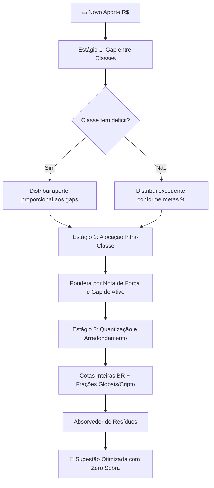

# 🌿 Diagrama Pantaneiro

<div align="center">


**Rastreador de carteira e assistente de rebalanceamento inteligente de investimentos.**  
Inspirado na metodologia do *"Diagrama do Cerrado"* (AUVP / Raul Sena) e no método de investimento cego com foco em fundamentos e disciplina de aportes.

[Início Rápido](#-início-rápido) • [Como Funciona](#-como-funciona-o-algoritmo) • [Classes Suportadas](#-classes-de-ativos) • [Funcionalidades](#-funcionalidades) • [Guia de Telas](#-guia-de-uso) • [Desenvolvimento](#-desenvolvimento-local)

</div>

---

## 🎯 Visão Geral

O **Diagrama Pantaneiro** resolve o problema do investidor que deseja manter sua alocação de ativos no piloto automático:
1. Você define os **percentuais-alvo** da sua carteira (ex: 30% Ações, 20% FIIs, 20% Ações Internacionais, 15% Cripto, 15% Renda Fixa).
2. Você avalia a **qualidade/fundamentos** dos seus ativos através de questionários de critérios (*Diagrama*).
3. Ao informar o **valor do aporte mensal**, o algoritmo calcula exatamente onde aportar para equilibrar a carteira sem nunca ultrapassar o teto de nenhuma classe e aproveitando 100% do seu capital.



---

## ✨ Funcionalidades

| Recurso | Descrição |
| :--- | :--- |
| 🗂️ **Múltiplas Carteiras** | Crie carteiras separadas (ex: Aposentadoria, Curto Prazo, Filhos) isoladas por usuário via header `X-Portfolio-Id`. |
| ⚖️ **Algoritmo de Aporte em 3 Estágios** | Distribui o capital entre classes, pondera por força e converte em cotas exatas minimizando sobras. |
| ❌ **Exclusão e Rebalanceamento Dinâmico** | Não quer aportar em determinado ativo sugerido no mês? Clique em `✕` e o sistema redistribui automaticamente o valor entre os demais ativos sem vazar dinheiro. |
| 📋 **Questionário do Diagrama** | Pontuação de força fundamentada (`força = 2 × sim − N`). Ativos sem critérios atendidos não recebem aportes. |
| 🔍 **Busca Automática com Autocomplete** | Pesquisa integrada em tempo real para Ações BR, FIIs, Ações Globais (US), REITs, Cripto e Tesouro Direto. |
| 🔒 **Modo Privacidade** | Botão no menu para mascarar valores em R$ ao tirar screenshots ou gravar a tela. |
| 📊 **Histórico e Aplicação de Aportes** | Registre os aportes executados para atualizar a quantidade da sua posição na carteira automaticamente. |
| 🗑️ **Gestão Completa de Posições** | Edite quantidade, preço, respostas de diagrama ou remova ativos da carteira com 1 clique. |

---

## 🧭 Classes de Ativos Suportadas

| Código | Classe | Provedor de Preço / Busca | Fracionamento | Cálculo de Força |
| :--- | :--- | :--- | :--- | :--- |
| `acoes_nacionais` | Ações Brasileiras | Brapi / Yahoo Finance | Cotas inteiras | Diagrama (`2×sim - N`) |
| `acoes_internacionais` | Ações Internacionais | Yahoo Finance (`.US` etc.) | Até 4 casas decimais | Diagrama (`2×sim - N`) |
| `fundos_imobiliarios` | Fundos Imobiliários (FIIs) | Brapi / Yahoo Finance | Cotas inteiras | Diagrama (`2×sim - N`) |
| `reits` | Real Estate Investment Trusts | Yahoo Finance | Até 4 casas decimais | Diagrama (`2×sim - N`) |
| `criptomoedas` | Criptoativos (BTC, ETH, etc.) | CoinGecko | Até 4 casas decimais | Força Manual (`≥ 0`) |
| `rendafixa` | Renda Fixa Nacional | Tesouro Direto / Manual | Frações ou BRL direto | Força Manual (`≥ 0`) |
| `rendafixa_internacional` | Renda Fixa Internacional | Manual | Frações ou BRL direto | Força Manual (`≥ 0`) |

---

## 🧠 Como Funciona o Algoritmo

O motor de cálculo (`backend/app/services/algorithm.py`) opera em um pipeline estrito:

### 1. Estágio 1: Distribuição Inter-Classes
* Calcula o valor da carteira pós-aporte: `novo_total = total_atual + aporte`.
* Para cada classe com meta percentual $> 0$ e com pelo menos um ativo elegível, calcula o **gap**:
  $$\text{gap}_{\text{classe}} = \max\left(0, (\text{meta}\% \times \text{novo\_total}) - \text{valor\_atual}\right)$$
* Se $\sum \text{gap} \ge \text{aporte}$, distribui o aporte proporcionalmente aos gaps (nenhuma classe ultrapassa sua meta).
* Se $\sum \text{gap} < \text{aporte}$, fecha todos os gaps e reparte o excedente segundo as metas percentuais.

### 2. Estágio 2: Distribuição Intra-Classe
* Dentro de cada classe, divide o montante entre os ativos elegíveis.
* Ponderação:
  1. Ativos com nota de força calculada pelo diagrama ($\text{peso} = \max(0, \text{força})$).
  2. Fallback: proporção do valor patrimonial atual.
  3. Fallback secundário: divisão igualitária.

### 3. Estágio 3: Quantização e Absorção de Resíduos
* **Ações BR e FIIs:** Arredondados para baixo em cotas inteiras (`floor`).
* **Ações US, REITs e Cripto:** Fracionamento em até 4 casas decimais.
* **Absorvedor de Resíduos:**
  * **Tier 1:** Absorve sobras em ativos de alta precisão (Criptomoedas, Ações US, REITs ou RF sem PU).
  * **Tier 2:** Absorve em títulos públicos do Tesouro Direto em frações de $0{,}01$.
  * **Tier 3 (Novo):** Caso a carteira só possua ativos inteiros (ações BR/FIIs), distribui cotas inteiras adicionais iterativamente para os ativos com melhor nota e maior déficit até que o saldo restante seja menor que o preço da cota mais barata.

---

## 🚀 Início Rápido

### Pré-requisitos
* [Docker](https://docs.docker.com/get-docker/) e [Docker Compose](https://docs.docker.com/compose/) instalados.

### 1. Clonar e Configurar
```bash
git clone https://github.com/LucasGazula/diagrama_pantaneiro.git
cd diagrama_pantaneiro

cp .env.example .env
```

Edite o arquivo `.env` para definir uma chave JWT segura:
```bash
# Gerar chave JWT segura (32+ caracteres):
python -c "import secrets; print(secrets.token_urlsafe(64))"
```

### 2. Subir a Aplicação
```bash
docker compose up --build -d
```

### 3. Acessar
* 🖥️ **Interface Web:** [http://localhost:8081](http://localhost:8081)
* 📖 **Documentação da API (Swagger):** [http://localhost:8001/docs](http://localhost:8001/docs)

---

## 🖥️ Guia de Uso

### 1. Cadastro e Carteira Inicial
1. Crie sua conta na tela de registro.
2. Na página inicial (`/home`), clique em **Metas** para definir sua distribuição percentual ideal (a soma deve ser 100%).

### 2. Adicionar Posições
1. Clique em **+ Adicionar Posição**.
2. Selecione a classe e digite o ticker no campo de busca (ex: `PETR4`, `AAPL`, `HGLG11`, `BTC`, `Tesouro IPCA+`).
3. Para Ações e FIIs, responda às perguntas do questionário de critérios para calcular a **Força** do ativo.

### 3. Realizar Aporte
1. Acesse **Aporte** no menu superior.
2. Digite o valor que deseja investir e clique em **Calcular**.
3. O sistema exibirá a tabela com quantidade e valor sugerido para cada ativo.
4. Caso não queira comprar algum ativo específico no momento, clique no botão **`✕`** da linha correspondente: o sistema recalcula instantaneamente e aproveita todo o saldo disponível nos demais ativos.
5. Após executar a compra na sua corretora, clique em **Aportar!** para consolidar a quantidade na carteira.

### 4. Editar ou Deletar Posições
* Na tabela da tela inicial, clique no nome de qualquer ativo para abrir o formulário de edição ou clique em **Deletar** para removê-lo da carteira.

---

## 💻 Desenvolvimento Local

Caso prefira rodar fora do Docker:

### Backend (Python 3.12 + `uv`)
```bash
cd backend
uv sync
uv run alembic upgrade head
JWT_SECRET=sua-chave-secreta uv run uvicorn app.main:app --reload --port 8000
```

### Frontend (Node.js 22+ / SvelteKit 5)
```bash
cd frontend
npm install
npm run dev
```

### Testes Automatizados
```bash
# Backend (pytest)
cd backend && uv run pytest

# Frontend (Vitest)
cd frontend && npm test
```

---

## 🔒 Segurança e Privacidade

* Todas as senhas são hasheadas com `bcrypt`.
* Autenticação assinado com JWT via `fastapi-users`.
* Dados e histórico armazenados localmente no seu banco SQLite (`backend/data/app.db`).
* Chaves de API e segredos nunca são rastreados no controle de versão (protegidos via `.gitignore`).

---

## 📄 Licença

Distribuído sob a licença **MIT**. Consulte `LICENSE` para mais informações.
