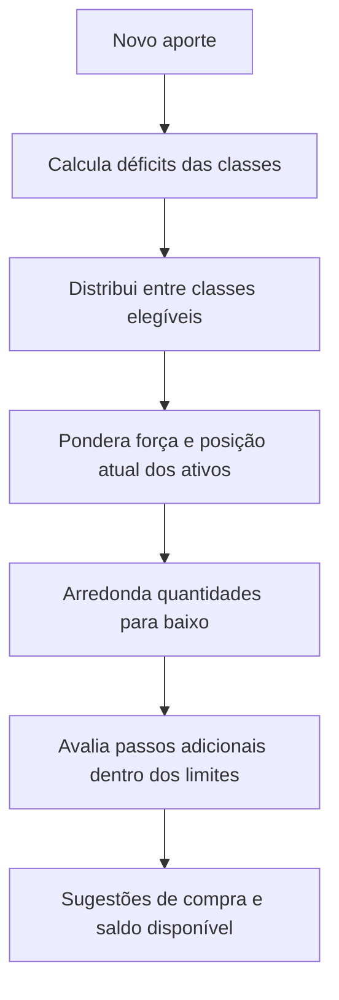

# Diagrama Pantaneiro


Rastreador de carteira e assistente de rebalanceamento inspirado na metodologia do **Diagrama do Cerrado** (AUVP / Raul Sena). O projeto combina metas de alocação, avaliação de fundamentos e disciplina de aportes.

[Visão geral](#visao-geral) · [Funcionalidades](#funcionalidades) · [Classes de ativos](#classes-de-ativos) · [Algoritmo](#algoritmo) · [Início rápido](#inicio-rapido) · [Guia de uso](#guia-de-uso) · [Desenvolvimento](#desenvolvimento) · [Sessão e dados](#sessao-e-dados)

<a id="visao-geral"></a>

## Visão geral

1. Defina percentuais-alvo para cada classe de ativos, com soma de 100%.
2. Avalie os fundamentos dos ativos pelos questionários do Diagrama ou informe força manual nas classes correspondentes.
3. Informe o aporte. O sistema sugere compras que aproximam a carteira das metas, respeitando orçamento e fracionamento de cada ativo.

Se uma compra ultrapassaria a meta da classe, ou não há ativo elegível, o valor permanece como **saldo disponível do aporte**. O algoritmo não garante investir 100% do depósito.



<a id="funcionalidades"></a>

## Funcionalidades

| Recurso | Comportamento |
| --- | --- |
| Múltiplas carteiras | Carteiras separadas por usuário, com posições, metas e histórico próprios. |
| Aporte em três estágios | Distribuição entre classes, ponderação entre ativos e quantização das compras. |
| Exclusão de sugestões | Remover um ativo recalcula o saldo restante; posições existentes e compras já aplicadas continuam consideradas. |
| Questionários do Diagrama | Força calculada por `2 × respostas positivas − total de perguntas`. |
| Busca de ativos | Autocomplete para ações brasileiras e internacionais, FIIs, REITs, cripto e Tesouro Direto. |
| Renda fixa explícita | Acompanhamento por saldo em reais ou por quantidade de títulos e preço unitário. |
| Proventos | Calendário por pagamento ou data-com, com valores recebidos e previstos para as posições atuais. |
| Histórico de aportes | Registro das sugestões e das compras aplicadas à carteira. |
| Modo privacidade | Mascara valores monetários e quantidades na interface. |
| Sessão persistente | Renovação automática do JWT por cookie de sessão, com revogação no logout. |

<a id="classes-de-ativos"></a>

## Classes de ativos

| Código | Classe | Cotação e busca | Passo de compra | Força |
| --- | --- | --- | --- | --- |
| `acoes_nacionais` | Ações brasileiras | Yahoo Finance; Brapi para cotação quando configurado | 1 ação | Diagrama |
| `acoes_internacionais` | Ações internacionais | Yahoo Finance | 0,0001 ação | Diagrama |
| `fundos_imobiliarios` | FIIs | Yahoo Finance; Brapi para cotação quando configurado | 1 cota | Diagrama |
| `reits` | REITs | Yahoo Finance | 0,0001 unidade | Diagrama |
| `criptomoedas` | Criptoativos | CoinGecko | 0,00000001 unidade | Manual, maior ou igual a zero |
| `rendafixa` | Renda fixa nacional | Tesouro Direto ou atualização manual | 0,01 título ou valor em reais | Manual, maior ou igual a zero |
| `rendafixa_internacional` | Renda fixa internacional | Atualização manual | 0,01 unidade ou valor em reais | Manual, maior ou igual a zero |

Ativos avaliados pelo Diagrama precisam de força positiva para receber sugestões. Ativos acompanhados por quantidade precisam de preço positivo. Falhas dos provedores externos podem impedir a atualização das cotações.

<a id="algoritmo"></a>

## Algoritmo

O cálculo está em [`backend/app/services/algorithm.py`](backend/app/services/algorithm.py).

### 1. Distribuição entre classes

O déficit de uma classe considera o patrimônio depois do aporte e todas as posições existentes, inclusive ativos excluídos das novas compras:

```text
novo_total = patrimônio_atual + aporte
valor_alvo = novo_total × percentual_alvo / 100
déficit = máximo(0, valor_alvo − valor_atual_da_classe)
```

- Considere somente classes com meta positiva e pelo menos um ativo elegível.
- Se os déficits elegíveis excedem o aporte, distribua o orçamento proporcionalmente a esses déficits.
- Caso contrário, cubra os déficits e mantenha o excedente disponível. Classes já acima da meta não recebem novas compras.

### 2. Distribuição dentro da classe

Distribua a parcela da classe conforme os déficits dos ativos e seus pesos. Os pesos usam força positiva; quando não há força positiva entre os ativos elegíveis, usam o valor atual das posições ou, se necessário, divisão igualitária.

### 3. Quantização e resíduos

Arredonde a quantidade para baixo conforme o passo da classe. Para saldos manuais, a sugestão é um valor em reais, sem quantidade fictícia.

Os resíduos favorecem compras que melhoram a distribuição e respeitam orçamento e meta da classe. Cada ativo pode receber um passo adicional de arredondamento. O restante permanece disponível.

Excluir uma sugestão bloqueia novas compras naquele ativo. O recálculo preserva compras já aplicadas e usa somente o aporte ainda não gasto.

### Renda fixa e Tesouro Direto

- **Saldo manual:** o valor da posição é o saldo informado em reais. Preencher um preço não muda o acompanhamento.
- **Quantidade:** o valor da posição é a quantidade multiplicada pelo preço da unidade.
- Trocar o acompanhamento converte a posição existente. Salve essa conversão antes de editar o saldo ou a quantidade.
- O catálogo distingue produto, juros semestrais e vencimento completo. Renda+ e Educa+ exibem o ano de início da renda.
- A cotação registra a data da fonte. Preços antigos ficam sinalizados e bloqueiam sugestões automáticas para títulos desatualizados.
- CDBs, LCIs, LCAs e outros produtos privados continuam com atualização manual.

<a id="inicio-rapido"></a>

## Início rápido

Requisitos: Git, Docker e Docker Compose.

### 1. Clonar e configurar

```bash
git clone https://github.com/LucasGazula/diagrama_pantaneiro.git
cd diagrama_pantaneiro
cp .env.example .env
```

Gere uma chave e coloque o resultado em `JWT_SECRET` no arquivo `.env`:

```bash
python3 -c 'import secrets; print(secrets.token_urlsafe(64))'
```

`BRAPI_TOKEN` é opcional. Consulte [`.env.example`](.env.example) para as configurações de duração da sessão.

### 2. Construir, migrar e iniciar

```bash
docker compose build
docker compose run --rm --no-deps backend alembic upgrade head
docker compose up -d --no-build --wait
```

Execute a migração também ao atualizar uma instalação existente, antes de iniciar o backend novo. Faça backup do volume `backend_data` antes da atualização.

As migrações preservam os números existentes. Elas não reconstruem saldos que versões anteriores já converteram incorretamente; revise essas posições no formulário de edição.

### 3. Acessar e verificar

| Serviço | Endereço |
| --- | --- |
| Interface | [http://localhost:8081](http://localhost:8081) |
| Documentação da API | [http://localhost:8001/docs](http://localhost:8001/docs) |
| Saúde da API e banco | [http://localhost:8001/api/health](http://localhost:8001/api/health) |

```bash
docker compose ps
docker compose logs --tail 50 backend frontend
```

<a id="guia-de-uso"></a>

## Guia de uso

### Cadastro e metas

Crie uma conta e abra `/home`. Use **editar_metas** para definir a distribuição ideal, com soma de 100%. Crie carteiras separadas em `/portfolios` quando precisar.

### Posições

Use **adicionar**, escolha a classe e busque o ativo, por exemplo `PETR4`, `AAPL`, `HGLG11`, `BTC` ou `Tesouro IPCA+`. Selecione o resultado correspondente e informe a quantidade ou saldo. Responda ao Diagrama nas classes que o utilizam.

Para editar quantidade, preço, nome ou acompanhamento, clique no nome da posição na tela inicial. A exclusão da posição fica no formulário de edição.

### Aportes

1. Abra `/aporte`, informe o valor e calcule as sugestões.
2. Use `✕` para excluir uma sugestão e recalcular as compras restantes.
3. Confira o saldo disponível: parte do aporte pode permanecer sem sugestão para respeitar os limites.
4. Depois de comprar na corretora, aplique a sugestão no app para atualizar a posição.

O app registra compras; não executa ordens na corretora.

### Proventos e histórico

Abra `/proventos` para consultar o calendário e `/history` para revisar aportes. As projeções de proventos usam as quantidades atuais das posições.

<a id="desenvolvimento"></a>

## Desenvolvimento local

Requisitos: Python 3.12 ou superior, `uv` e Node.js 22 ou superior. Configure o `.env` na raiz conforme o início rápido.

### Backend

```bash
cd backend
uv sync
mkdir -p data
uv run --env-file ../.env alembic upgrade head
uv run --env-file ../.env uvicorn app.main:app --reload --port 8000
```

### Frontend

Em outro terminal, a partir da raiz do projeto:

```bash
cd frontend
npm ci
npm run dev
```

O frontend abre em `http://localhost:5173` e encaminha `/api` para `http://localhost:8000`. Para outro backend de desenvolvimento, defina `DEV_API_PROXY` ao iniciar o Vite.

### Verificação

Execute em `backend/`:

```bash
uv run pytest
uv run ruff check .
```

Execute em `frontend/`:

```bash
npm test -- --maxWorkers=1
npm run check
npm run build
```

<a id="sessao-e-dados"></a>

## Sessão e dados

- Senhas são armazenadas como hash. A API autentica requisições com JWT via `fastapi-users`.
- O JWT expira em 15 minutos por padrão. Um cookie HttpOnly com `SameSite=strict` permite renovação por até 30 dias. Logout revoga a sessão persistente.
- Configure `JWT_LIFETIME_SECONDS` e `REFRESH_LIFETIME_SECONDS` para ajustar as durações. Use `REFRESH_COOKIE_SECURE=true` quando servir por HTTPS.
- Falhas temporárias de rede preservam o login salvo. Uma instalação atualizada pode exigir um novo login para emitir o cookie persistente.
- No Docker, SQLite fica em `/app/data/app.db`, no volume `backend_data`. No desenvolvimento local, fica em `backend/data/app.db` por padrão.
- Metas, posições e aportes são separados por carteira. O cliente identifica a carteira ativa pelo header `X-Portfolio-Id`.
- `.env`, bancos locais e arquivos de execução ficam fora do controle de versão conforme [`.gitignore`](.gitignore).
